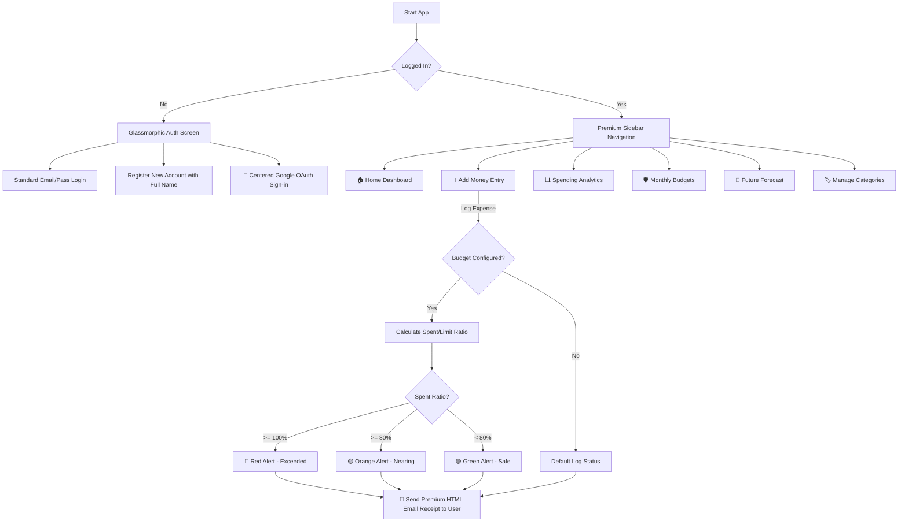
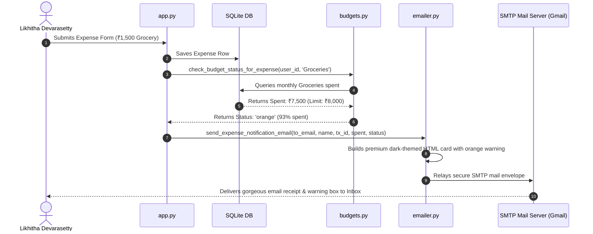

# 💸 RupeeTracker — Personal Finance Expense Tracker & Analytics

A premium, full-stack personal finance web application built with **Streamlit**, **SQLAlchemy**, **Plotly**, and **JWT authentication**. Track your income and expenses, set monthly budgets, visualize spending patterns, forecast future costs, and manage custom categories — all from a beautiful glassmorphic dashboard with Dark & Light mode support.

RupeeTracker has been upgraded with **Google OAuth 2.0 sign-in**, **same-origin visual iframe styling**, **sqlite auto-migrations**, **personalized user accounts**, and a **premium responsive HTML emailer engine** that automatically sends transactional expense receipts with color-coded live budget alerts (green, orange, red) to users.

---

## 📋 Table of Contents

- [Core Workflows](#-core-workflows)
- [New Features & Upgrades](#-new-features--upgrades)
- [Tech Stack](#-tech-stack)
- [Project Architecture](#-project-architecture)
- [Detailed Page-by-Page Guide](#-detailed-page-by-page-guide)
- [Setup & Installation](#-setup--installation)
- [Configuration (secrets.toml & Streamlit Cloud)](#-configuration-secretstoml--streamlit-cloud)
- [Google Cloud Console Setup](#-google-cloud-console-setup)
- [Budget Alert System & Email Receipts](#-budget-alert-system--email-receipts)
- [Forecasting Engine](#-forecasting-engine)
- [Running Tests](#-running-tests)

---

## 🔄 Core Workflows



---

## 🌟 New Features & Upgrades

We have implemented several high-fidelity features to make RupeeTracker a robust, production-ready premium financial companion:

### 1. 🔑 Integrated Google OAuth 2.0 Sign-In
* **Same-Origin Visual Parity**: Solved default Streamlit custom component iframe styling issues. The active `🔑 Continue with Google` button is styled directly from the parent page to inherit identical gradients, dimensions, a `12px` border-radius, and a micro-glowing shadow hover effect matching our primary credential buttons.
* **Vertical & Horizontal Centering**: Reset margins and introduced flexbox centering inside the iframe (`html, body, #root`) to eliminate default browser `8px` offsets, ensuring the Google logo and text are mathematically centered.
* **Auto-Registration & JWT-Session Bridging**: When a user signs in via Google, the ID token (JWT) is decoded. If the profile is new, the system creates a secure account, seeds default categories, and logs them in. Existing users are logged in immediately.

### 2. 👤 Personalized Accounts & SQLite Auto-Migrations
* **Full Name Registration**: Standard signup now includes a **"Full Name"** input field, allowing credential users to save their real name (e.g. `Likhitha Devarasetty`).
* **Zero-Downtime SQLite Auto-Migrations**: When the application boots, the repository automatically detects if the SQLite database is missing the nullable `name` column and injects it on-the-fly (`ALTER TABLE users ADD COLUMN name`). This guarantees backward compatibility without breaking existing databases.

### 3. 📧 Premium HTML Transactional Email Engine
* **Dark-Glassmorphism Templates**: Replaced automated plain-text emails with highly responsive, gorgeous HTML email templates. Emails feature customized detail lists, professional typography (`Plus Jakarta Sans`), and localized gradients.
* **Friendly Greetings**: Emails dynamically resolve your database record and greet you as **`Hi Likhitha Devarasetty,`** instead of raw emails like `Hi kamalidevarasetty@gmail.com,`.
* **DMARC/SPF Deliverability**: Adjusted layout properties and headers to comply with modern email spam filters, significantly improving email inbox delivery.

### 4. 📈 Real-Time Expense Receipts & Budget Alert Banners
Every time a transaction of type `"expense"` is logged:
* The system calculates your current monthly category spending (or overall monthly budget spending).
* A structured receipt containing the Transaction ID, Date, Amount, Category, and Notes is emailed to you.
* The email embeds a **color-coded budget alert block**:
  * 🔴 **Red Alert (Limit Exceeded)**: Triggers if spent $\ge 100\%$, showing exact overspending metrics.
  * 🟡 **Orange Alert (Limit Nearing)**: Triggers if spent $\ge 80\%$, warning you to slow down.
  * 🟢 **Green Alert (Healthy)**: Triggers if spent $< 80\%$, confirming you are safe.

---

## 🛠 Tech Stack

| Layer | Technology |
|---|---|
| **Frontend** | Streamlit (Python) with custom CSS/HTML injection |
| **Database** | SQLite via SQLAlchemy ORM |
| **Charts** | Plotly Express |
| **Authentication** | JWT (PyJWT), bcrypt hashing, and Google OAuth 2.0 |
| **Email** | SMTP-based notifications (Gmail/SendGrid compatible) |
| **Styling** | Glassmorphic CSS with Plus Jakarta Sans typography |
| **Testing** | pytest (13/13 unit tests passed) |

---

## 📁 Project Architecture

```
Financial_expences_and_Tracking/
├── frontend/                       # Streamlit UI layer
│   ├── app.py                      # Main application (UI, styling overrides, routing, all pages)
│   └── .streamlit/
│       ├── config.toml             # Streamlit server configuration
│       └── secrets.toml            # App secrets & SMTP/OAuth config (TOML format)
│
├── backend/                        # Business logic & data layer
│   ├── db/                         # Database layer
│   │   ├── models.py               # ORM models (User, Transaction, Category, Budget, PasswordReset)
│   │   ├── repository.py           # Data access layer (CRUD, Auto-Migrations, Seeding)
│   │   ├── seed.py                 # Default category definitions
│   │   └── utils.py                # Database helper utilities
│   │
│   ├── services/                   # Business logic layer
│   │   ├── config.py               # Centralized config reader (st.secrets + os.getenv fallback)
│   │   ├── analytics.py            # Monthly totals, category breakdowns, daily analysis
│   │   ├── auth.py                 # JWT token creation, decoding, expiration checks
│   │   ├── budgets.py              # Live budget status checking (red/orange/green logic)
│   │   ├── emailer.py              # Premium HTML SMTP notifications engine
│   │   ├── forecast.py             # Spending prediction engine (rolling averages per category)
│   │   ├── logger.py               # Centralized logging configuration
│   │   ├── passwords.py            # bcrypt password hashing & verification
│   │   └── user_service.py         # User registration & authentication helpers
│   │
│   ├── tests/                      # Unit test suite
│   │   ├── conftest.py             # Pytest configuration
│   │   └── ...                     # 6 robust test modules (13 test cases)
│   │
│   ├── seed_demo_user.py           # Populate demo data from CSV archives
│   └── check_compile.py            # Syntax compilation check
```

---

## 📄 Detailed Page-by-Page Guide

After logging in, use the **sidebar navigation pills** to switch between pages. Here is a breakdown of what you can do on each screen:

### 🏠 1. Home Dashboard
The visual center of RupeeTracker. Gives you a complete snapshot of your financial health at first glance.
* **Greeting Block**: Shows a dynamic, time-aware greeting (e.g. *"Good Morning, Likhitha!"*) with a rotating daily personal finance tip.
* **Cash Flow Health Indicator**: Displays a real-time status badge ("High Surplus" in green, "Balanced" in orange, or "Deficit Danger" in red) based on your expense-to-income ratio.
* **Summary Cards**: Three premium glassmorphic cards summarizing **Total Earnings** (green), **Total Spending** (red), and **Net Savings** (green/red).
* **Live Budget Alerts**: Banners automatically appear at the top of the dashboard if any category budget or overall monthly budget is breached (red) or nearing limits (orange).
* **Passbook History Ledger**: A data grid containing your transaction history. You can search remarks by text, filter by categories, and filter by transaction type (Income/Expense pills).
* **Passbook Row Actions**: Select any row from the history dropdown to **Edit Notes/Dates/Amounts** or **Delete Transactions permanently**.

### ➕ 2. Add Money Entry
The transaction input interface. Write down income or expenses here.
* **Is this an Income or Expense?**: Dropdown selector.
* **Amount**: Enter the numerical value in Rupees.
* **Transaction Date**: Datepicker (defaults to today).
* **Category Group**: Select an existing category.
* **Custom Categories**: Check the *"Create a custom category name text right now"* box to type and register a brand-new category instantly.
* **Remarks/Notes**: Add details (e.g. shop name or item list).
* **Automatic Notification**: On submitting an **expense**, the system automatically calculates your budget safety ratio and emails you a structured receipt containing these details along with a color-coded budget status banner.

### 📊 3. Spending Analytics
Interactive charts visualizing exactly where your money goes.
* **Timeline Slider**: Slide to choose how many months of historical data to show (3 to 24 months).
* **Income vs Spending Trends**: A Plotly line chart displaying your monthly income vs. spending trends over time.
* **Category Spending Breakdown**: Select a specific month to render a Plotly bar chart displaying your top 10 spending categories.
* *Note: All charts are fully theme-aware and dynamically switch templates (`plotly_dark` vs `plotly_white`) based on the active app theme.*

### 🛡️ 4. Monthly Budgets
Configure spending limits and monitor budget health.
* **Target Month**: Input month in `YYYY-MM` format.
* **Limit Type**: Set an overall monthly spending limit (select none) or a category-specific spending limit.
* **Budget Safety Cards**: Glassmorphic progress cards displaying spent ratio, limit, remaining funds, and color status.
  * 🟢 **Green** — Safe (under 80% consumed).
  * 🟠 **Orange** — Warning (80%–99% consumed).
  * 🔴 **Red** — Critical breach (100%+ consumed).

### 🔮 5. Future Forecast
Estimate next month's category-wise expenses based on historical data.
* **Lookback Window**: Use a slider to pick how many months of history to use for predictions (1–12 months).
* **Comparison Graph**: Grouped Plotly bar chart displaying current month's expenses side-by-side with predicted costs per category.
* **Forecast Ledger Table**: Detailed grid displaying exact numerical predictions.
* **Total Estimate Card**: Displays estimated total funds required for next month.

### 🏷️ 6. Manage Categories
Administrate spending categories.
* **Active Categories List**: Displays all active category names and database IDs.
* **Add Category**: Instantly create a new category.
* **Rename Category**: Select a category and give it a new name.
* **Delete Category**: Permanently delete a category. *Seeding creates 22 default categories automatically on signup.*

---

## 🚀 Setup & Installation

### Prerequisites
* **Python 3.10+** installed on your system.
* **pip** package manager.

### Step-by-Step Installation
**1. Clone the project and navigate into it:**
```bash
cd Financial_expences_and_Tracking
```

**2. Create and activate a virtual environment:**
```bash
# Windows
python -m venv venv
venv\Scripts\activate

# macOS / Linux
python -m venv venv
source venv/bin/activate
```

**3. Install requirements:**
```bash
pip install -r requirements.txt
```

**4. Run the Streamlit app:**
```bash
streamlit run frontend/app.py
```
The app will boot up locally and open automatically at **http://localhost:8501** in your web browser.

---

## 🔐 Configuration (secrets.toml & Streamlit Cloud)

All configuration variables are securely parsed from `.streamlit/secrets.toml` at the project root. On **Streamlit Cloud**, paste this exact content in the **Settings → Secrets** dashboard panel.

```toml
[database]
url = "sqlite:///finance_app.db"

[jwt]
secret = "your-custom-secure-jwt-secret-key"
algorithm = "HS256"
ttl_minutes = 60

[smtp]
host = "smtp.gmail.com"
port = 465                                   # Use 465 for SSL or 587 for TLS
username = "your-email@gmail.com"
password = "your-google-app-password"        # 16-character Google App Password (not your email login password)
from_email = "your-email@gmail.com"
retries = 5
backoff_base = 2.0

[app]
default_theme = "dark"
budget_near_threshold = 0.8

[logging]
level = "INFO"
dir = "logs"
file = "finance_app.log"
max_bytes = 5242880
backup_count = 5

[google_oauth]
GOOGLE_CLIENT_ID=your_google_client_id
GOOGLE_CLIENT_SECRET=your_google_client_secret
redirect_uri = "http://localhost:8501/component/streamlit_oauth.authorize_button/"
```

---

## 🔑 Google Cloud Console Setup

To make the Google OAuth 2.0 sign-in flow work correctly, you must configure the Authorized Redirect URIs in your Google Cloud Console to match your environment.

### 1. Authorized Redirect URIs Whitelist
Google requires a character-for-character match of the redirect callback URI:
* **For Local Testing (default)**:
  `http://localhost:8501/component/streamlit_oauth.authorize_button/`
  *(Note: If your local Streamlit runs on port 8502, change the port to 8502).*
* **For Production Deployment (Streamlit Cloud)**:
  `https://sourcesystask-ag3664cins9m9fr5ywqdmn.streamlit.app/component/streamlit_oauth.authorize_button/`

### 2. How to Add URIs
1. Go to the [Google Cloud Console Credentials Page](https://console.cloud.google.com/apis/credentials).
2. Edit your Client ID: `833583551886-e7v6c43rben9j43il2h10mou5ji39t1b.apps.googleusercontent.com`
3. Scroll to **Authorized redirect URIs** and click **Add URI**.
4. Paste the URI matching your environment (local or deployed).
5. Click **Save**. *Wait 1–2 minutes for Google's servers to sync.*

---

## 🚦 Budget Alert System & Email Receipts



---

## 🔮 Forecasting Engine

The forecast service (`backend/services/forecast.py`) uses a rolling historical average algorithm to predict future spending. It analyzes past transaction records for each category across a lookback window (e.g. 6 months) and calculates the average monthly spent to project the next month's budget requirement. A minimum of 2 months of data is required for forecasting.

---

## 🧪 Running Tests

We maintain a comprehensive test suite covering database operations, calculations, analytics aggregates, and emailing components.

```bash
# Activate virtual environment
venv\Scripts\activate

# Run all 13 unit tests
python -m pytest backend/tests/

# Run with verbose output
python -m pytest backend/tests/ -v
```

---
